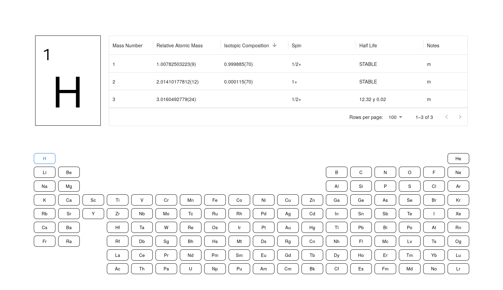

# Periodica

A minimalist periodic table focused on isotopes.

## Introduction

Periodica is a specialized periodic table that visualizes *isotopic properties* in an intuitive, interactive format. Born out of a need for quick access to nuclear spin and abundance data during spectroscopy research, it solves a common problem: integrating isotope and spin information.

Key data displayed:
- *Atomic & mass numbers*
- *Relative atomic masses*
- *Nuclear spins*
- *Isotopic abundances*
- *Half-lives* (for unstable isotopes)

Built for:
- *Researchers* (NMR/EPR, nuclear chemistry)
- *Educators* (teaching isotopes/periodicity)
- *Students* (learning atomic structure)

Click any element to see *all its isotopes* in a sortable table or in a double donut chart.

## Data sources

### Atomic Properties
Periodica uses atomic data from NIST's *Atomic Weights and Isotopic Compositions* database:
- J. S. Coursey, D. J. Schwab, J. J. Tsai, and R. A. Dragoset  
  (NIST Physical Measurement Laboratory)

Key datasets:
- Atomic weights: J. Meija et al (2013)
- Isotopic compositions: M. Berglund and M.E. Wieser (2009)
- Relative atomic masses: M. Wang et al (AME2012 evaluation)

Data includes:
- Relative atomic masses (with uncertainties)
- Isotopic abundances
- Standard atomic weights
- Special annotations for geological/commercial materials

### Nuclear Spins
Spin dataset was manually compiled from spectroscopy literature and marked with "?" when unconfirmed.

# License

License: MIT
